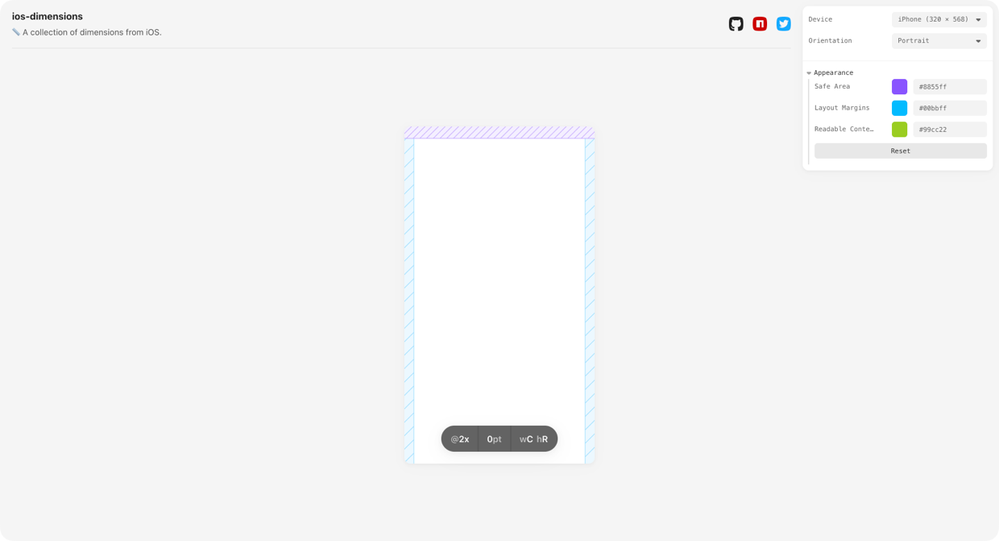

# ios-dimensions

📏 ️A collection of dimensions from iOS.

[](https://github.com/bouchenoiremarc/ios-dimensions/actions/workflows/ci.yml) [](https://www.npmjs.com/package/ios-dimensions) [](https://www.npmjs.com/package/ios-dimensions) [](https://github.com/bouchenoiremarc/ios-dimensions/blob/main/LICENSE)



🔗 Explore and preview dimensions in the [playground](https://marcbouchenoire.com/projects/ios-dimensions).

## Installation

#### Skypack

```html
<script type="module">
  import { dimensions } from "https://cdn.skypack.dev/ios-dimensions"
</script>
```

#### Yarn

```sh
yarn add ios-dimensions
```

#### npm

```sh
npm install ios-dimensions
```

## Usage

#### `dimensions`

Import `dimensions`.

```tsx
import { dimensions } from "ios-dimensions"

// dimensions: [Dimension, Dimension, Dimension...]
```

#### `getDimensions`

Import `getDimensions`.

```tsx
import { getDimensions } from "ios-dimensions"
```

Given no arguments, `getDimensions` will also return all dimensions.

```tsx
const dimensions = getDimensions()

// dimensions: [Dimension, Dimension, Dimension...]
```

Given a specific `width` and `height`, `getDimensions` will return dimensions that match the specified `screen` size, either in portrait or landscape.

```tsx
const dimensions = getDimensions(320, 568)

// dimensions: [Dimension]
```

## Automation

Dimensions are extracted from iOS with the `generate` command—using Xcode and Simulator.


## Related

[🔣 ios-symbols](https://github.com/bouchenoiremarc/ios-symbols): A collection of every symbol from SF Symbols.
